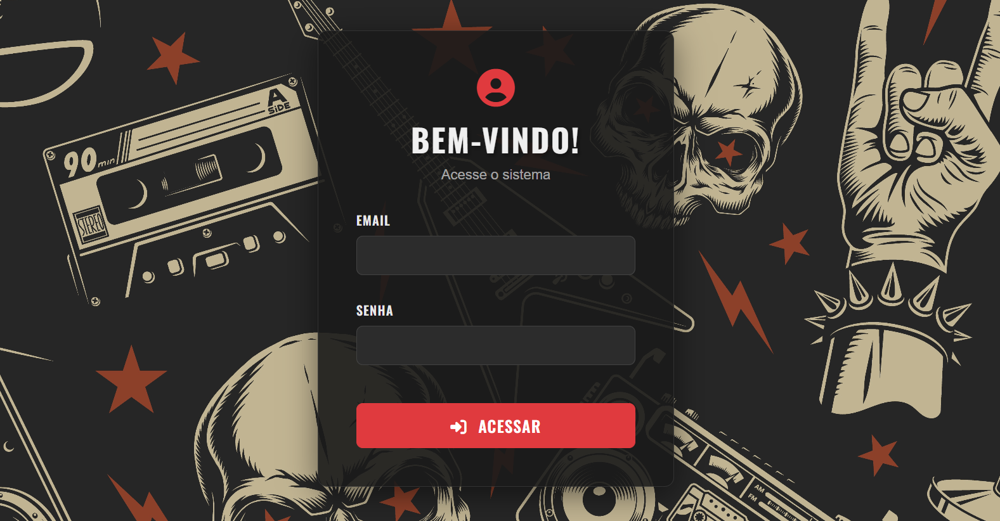
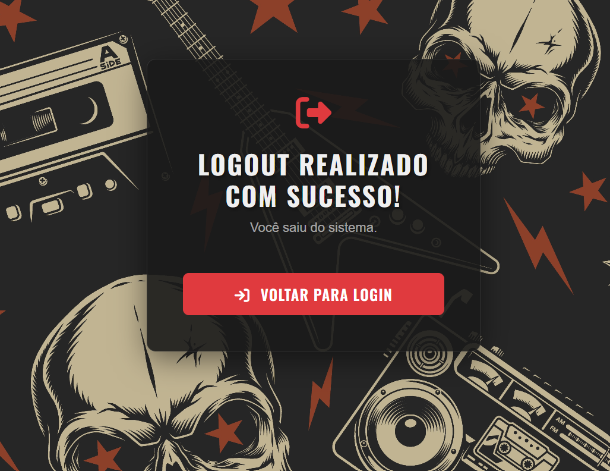
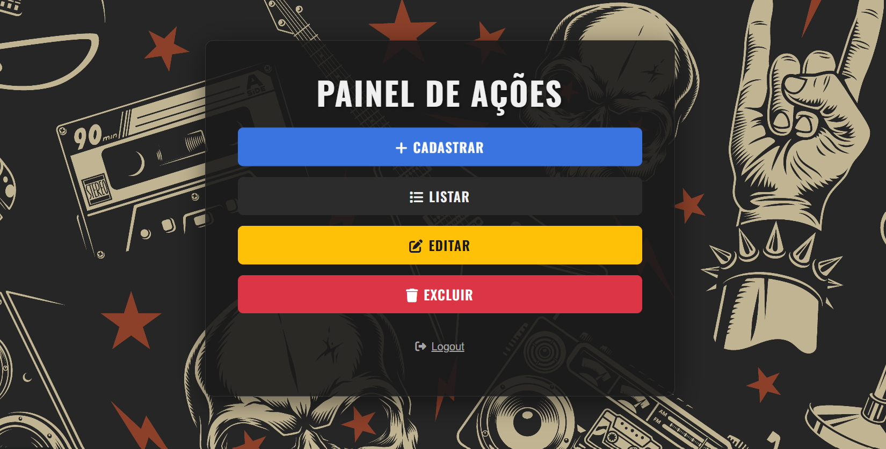
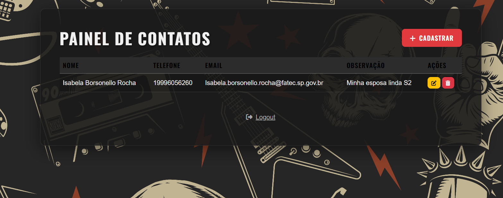
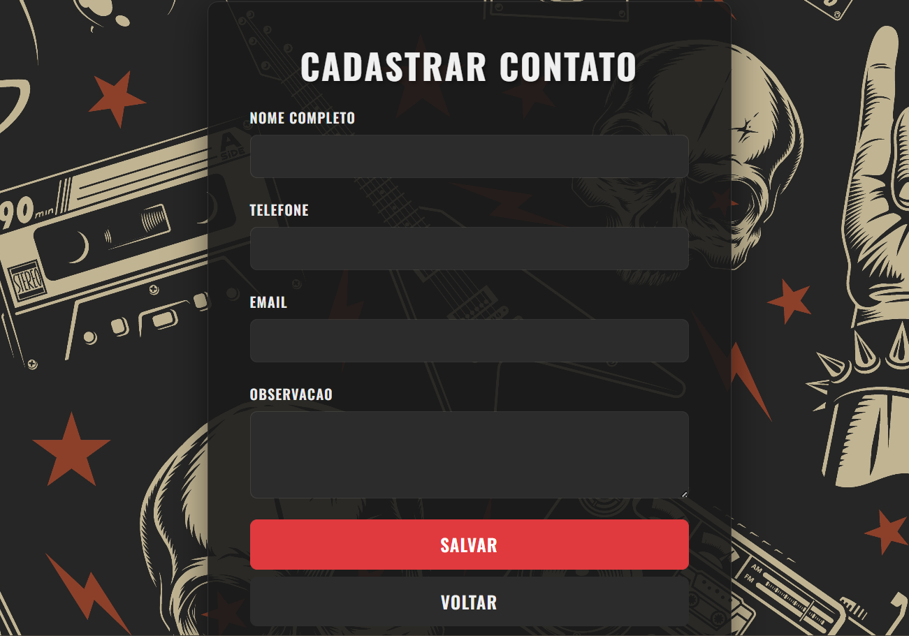
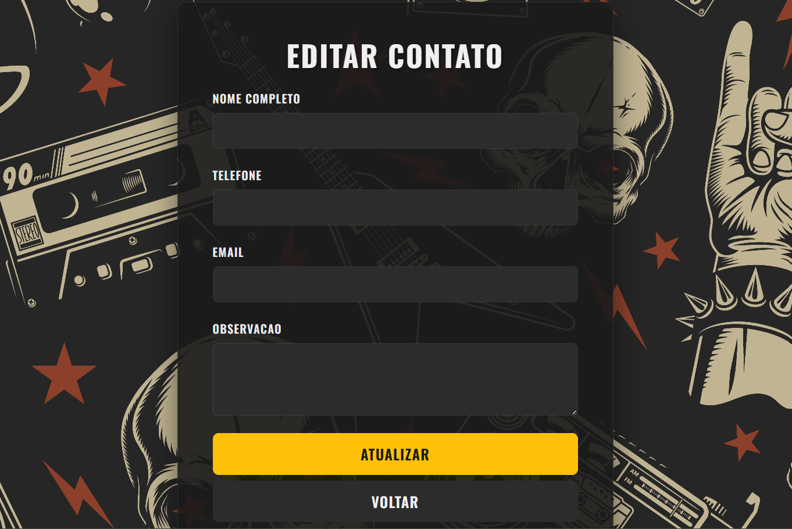
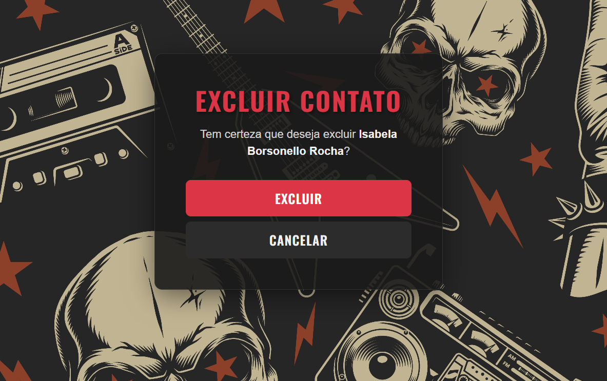

# 🎸 Agenda Rock: CRUD em Django

Este é o meu projeto de agenda de contatos em Django.

Eu queria ir além do CRUD (Create, Read, Update, Delete) básico e focar em construir uma interface com personalidade. Em vez do visual padrão do Bootstrap, eu decidi criar um tema **"Rock N' Roll"** completo, usando um layout escuro, fontes customizadas e uma identidade visual consistente em todas as páginas.

Este projeto serve como um ótimo template para quem quer uma aplicação Django com autenticação e CRUD já estilizados.

## 📸 A Aplicação em Ação (Screenshots)

Me certifiquei de que o tema "Rock" fosse aplicado em **todo** o fluxo do usuário, desde a autenticação até a exclusão de um registro.

### 1. Autenticação (Login e Logout)

A porta de entrada do sistema. Criei um formulário de login limpo que já estabelece a identidade visual "Rock" com o fundo texturizado e o card escuro. A tela de logout segue o mesmo padrão, confirmando que o usuário saiu com segurança.





### 2. Painel de Ações (A "Home")

O "hub" principal. Esta é a primeira tela que o usuário vê após o login. Eu usei a fonte "Oswald" para dar impacto ao título e criei botões grandes e claros para direcionar o usuário às funções principais (Cadastrar, Listar, etc.).



### 3. Listagem de Contatos (Read)

Esta é a tela de "Listar", onde a tabela de contatos é exibida. Eu customizei a tabela padrão do Bootstrap para o modo escuro, com um cabeçalho destacado, linhas "zebradas" (striped) e um efeito de "hover" que combina com o tema. Os botões de ação (Editar, Excluir) também usam as cores do tema.



### 4. Cadastrar e Atualizar (Create / Update)

Os formulários de "Cadastrar" e "Editar" são o coração do CRUD. Eu estilizei todos os campos (`input`, `textarea`) para o modo escuro. O mais importante é que até mesmo as **mensagens de erro do Django** foram customizadas para se integrarem ao visual, usando os tons de vermelho do tema.





### 5. Confirmação de Exclusão (Delete)

Uma tela de confirmação simples, mas importante. Eu usei a paleta de cores de "perigo" (vermelho) no título e no botão principal ("Excluir") para deixar claro para o usuário que ele está prestes a tomar uma ação destrutiva.



---

## 🚀 Requisitos do Sistema (Features)

O sistema cobre todas as operações essenciais de gerenciamento de contatos e autenticação que eu implementei:

* **Autenticação de Usuários:** Sistema completo com telas de Login e Logout.
* **Painel de Ações:** Um menu principal que serve como "home" após o login.
* **Create (Cadastrar):** Formulário para adicionar novos contatos.
* **Read (Listar):** Uma tabela estilizada (dark mode) que exibe todos os contatos.
* **Update (Atualizar):** Formulário para editar contatos existentes.
* **Delete (Excluir):** Página de confirmação para deletar um contato com segurança.

---

## 🛠️ Tecnologias que Eu Usei

Para construir este projeto, eu utilizei:

* **Back-end:**
  * **Python 3**
  * **Django 4+** (Usei para toda a lógica de back-end, ORM, autenticação e gerenciamento de rotas).
* **Front-end:**
  * **HTML5**
  * **CSS3** (Utilizei Variáveis CSS para criar o tema "Rock" facilmente).
  * **Bootstrap 5** (Minha base para o grid, layout responsivo e componentes).
  * **Font Awesome** (Para os ícones em todos os botões e títulos).
  * **Google Fonts** (Importei a fonte **"Oswald"** para dar aos títulos um visual mais forte e impactante).
* **Database:**
  * **SQLite3** (O banco de dados padrão do Django, perfeito para desenvolvimento).

---

## 🎨 A Identidade Visual

O maior foco deste projeto foi o design. Eu customizei 100% do visual:

* **Tema Escuro:** Todas as páginas usam um fundo texturizado escuro, com um card central semi-transparente.
* **Consistência Total:** Todos os elementos — formulários, tabelas, botões (primários, de perigo, de aviso) e até mesmo as mensagens de erro do Django — foram estilizados para combinar com a paleta de cores "Rock".
* **Gestão de Imagem:** Implementei a forma correta do Django de servir arquivos estáticos (``) para o fundo do `<body>`, garantindo que funcione tanto em desenvolvimento quanto em produção.

---

## 🏃 Como Rodar

Se você quiser rodar este projeto na sua máquina:

1. **Clone o repositório:**
   **Bash**

   ```
   git clone [URL_DO_SEU_REPOSITORIO_AQUI]
   cd nome-do-projeto
   ```
2. **Crie e ative um ambiente virtual (venv):**
   **Bash**

   ```
   # (No Windows)
   python -m venv venv
   .\venv\Scripts\activate

   # (No macOS/Linux)
   python3 -m venv venv
   source venv/bin/activate
   ```
3. **Instale as dependências:**
   *(Você precisará criar um `requirements.txt` ou só instalar o Django)*
   **Bash**

   ```
   pip install django
   ```
4. **Execute as migrações** para criar o banco de dados:
   **Bash**

   ```
   python manage.py migrate
   ```
5. **Crie um superusuário** (para você poder logar no sistema):
   **Bash**

   ```
   python manage.py createsuperuser
   ```
6. **Inicie o servidor:**
   **Bash**

   ```
   python manage.py runserver
   ```
7. Pronto! Abra `http://127.0.0.1:8000/login/` no seu navegador.

---

## 🙏 Agradecimentos

Este projeto foi uma jornada de aprendizado, e eu não teria chegado até aqui sozinho. Quero dedicar um agradecimento especial:

* À minha esposa, por ser meu pilar e por sempre me apoiar incondicionalmente em todos os desafios.
* À minha filha, que com seu sorriso me dá a motivação diária para vencer qualquer obstáculo na vida.
* Aos meus amigos e colegas de turma, pela parceria, pelas discussões e pela ajuda mútua.
* A todos os professores da  **Fatec Araras** , pelo conhecimento compartilhado, pela paciência e por me guiarem nesta caminhada de formação.

Meu muito obrigado a todos vocês!
